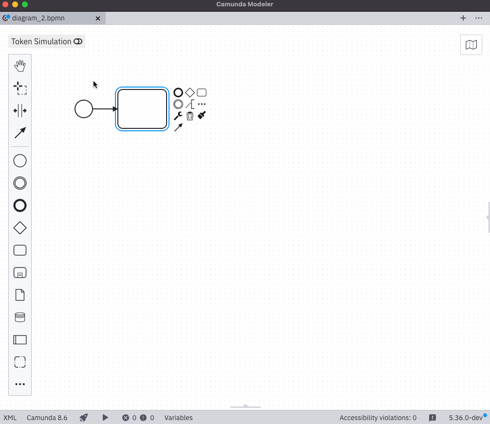

# camunda-modeler-autosave-plugin


[](https://github.com/camunda/camunda-modeler) [](#)

This plugin provides an *auto-save mechanism* that saves your diagram changes after a specified interval.

It demonstrates how to extend the [Camunda Modeler](https://github.com/camunda/camunda-modeler) user interface with a custom React component, and explains how to use various utilities available for plugin development.



> [!NOTE]  
> This is a fork of [pinussilvestrus/camunda-modeler-autosave-plugin](https://github.com/pinussilvestrus/camunda-modeler-autosave-plugin), updated to use the settings feature introduced in Camunda Modeler 5.35. For an example of building a custom overlay, see the original repository.

## How to use

1. Download the latest release artifact.
1. Extract it into the `plugins` directory of the Camunda Modeler.
2. Start the Camunda Modeler.
3. Enable and configure the autosave mechanism via app settings.

Refer to the [plugins documentation](https://docs.camunda.io/docs/components/modeler/desktop-modeler/plugins/) to get detailed information on how to create and integrate Camunda Modeler plugins.

## Development Setup

1. Clone this repository to the `plugins` directory of the Camunda Modeler.
2. Install all dependencies:

```bash
npm install
```

3. Bundle the plugin:

```bash
npm run all
```

or make it bundle after every change:

```bash
npm run dev
```

## Compatibility Notice

This plugin is currently compatible with the following Camunda Modeler versions.

| Camunda Modeler | Autosave Plugin |
|---|---|
| 3.4 - 4.12  | 0.2 |
| 5.x | 0.3 |
| >= 5.35 | 0.4 | 

## About

The [`AutoSavePlugin`](./client/AutoSavePlugin.js) component implements the basic functionality to add the autosave mechanism into the Camunda Modeler.

It uses `<Fill>` component provided by `camunda-modeler-plugin-helpers` to render into a specific place in the application UI. In this case, we render an icon into the status bar to indicate that the autosave is enabled.

```js
import { Fill } from 'camunda-modeler-plugin-helpers/components';

...

return (
  <Fill slot="status-bar__app" group="1_autosave">
    <button className="btn" title="AutoSave enabled"><Icon /></button>
  </Fill>
);
```

To allow users to enable the plugin and set a custom save interval, we use [Settings](https://docs.camunda.io/docs/next/components/modeler/desktop-modeler/settings/) feature in Camunda Modeler.

When the plugin component first renders, it uses the [Settings API](https://github.com/camunda/camunda-modeler/blob/main/client/src/app/Settings.js) provided in the `props` to register its settings, retrieve any existing user-defined values, and subscribe to future changes.

```js
useEffect(() => {
    const values = settings.register(pluginSettings);

    setEnabled(values['autoSavePlugin.enabled']);
    setValidInterval(values['autoSavePlugin.interval']);

    settings.subscribe('autoSavePlugin.enabled', ({ value }) => {
      setEnabled(value);
    });

    settings.subscribe('autoSavePlugin.interval', ({ value }) => {
      setValidInterval(value);
    });
  }, [ settings ]);
```

Furthermore, it _hooks into certain application events_ to properly setup and restart the auto save timer.

```js
useEffect(() => {
    subscribe('app.activeTabChanged', ({ activeTab }) => {
      setActiveTab(activeTab);
    });

    subscribe('tab.saved', () => {
      if (enabled && !timer.current) {
        startTimer();
      }
    });
  }, [ subscribe ]);
```

As a main purpose the extension should save diagram changed after a defined amount of time. To do this, it uses the given `triggerAction` functionality to _send a save request_ to the application. When something got wrong, plugins are even allowed to _display notification_ on the UI.

```js
const save = () => {
  triggerAction('save')
    .then(tab => {
      if (!tab) {
        return displayNotification({ title: 'Failed to save' });
      }
    });
};
```

To properly work inside the Camunda Modeler application, every plugin needs to have a general entry point, in this example named the [`index.js`](./index.js). This gives general information about where to find the React component, general styling, and, if needed, application menu extensions. To get detailed information about how to integrate a plugin into the Camunda Modeler, please refer to the existing [plugins documentation](https://docs.camunda.io/docs/components/modeler/desktop-modeler/plugins/).

```js
module.exports = {
  script: './dist/client.js',
  style: './client/style.css',
  name: 'autosave-plugin'
};
```

To work inside a browser application, the React extension needs to be bundled. Refer to the [`webpack.config.js`](./webpack.config.js) on how to achieve this.

## Resources

* [Camunda Modeler plugins documentation](https://docs.camunda.io/docs/components/modeler/desktop-modeler/plugins/)

## License

MIT

